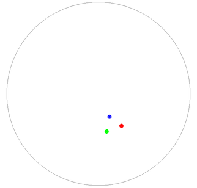

# Projective Plane

Animation of three points on a projective plane. Created with [gloss](https://hackage.haskell.org/package/gloss).

Use the mouse to control the direction of movement.

## What is the projective plane?

The [projective plane](https://en.wikipedia.org/wiki/Real_projective_plane) is a topological surface. You can think of it as a sphere where opposite points are considered identical, or as a hemisphere where opposite points on the boundary are considered identical. The projective plane cannot be embedded in 3d space, but _can_ be embedded in 4d space. (There is an [immersion](https://en.wikipedia.org/wiki/Boy's_surface) of the projective plane in 3d space, but this is difficult to visualise).

The projective plane is non-orientable, which means there is no consistent definition of "clockwise". You can see this in the animation: at the beginning, the red point is clockwise from the green point. But if you go off the edge and reappear on the other side, the red point is _counterclockwise_ from the green point. This property has some strange implications. If the Earth were a projective plane instead of a sphere, and you traveled in a straight line until you returned to your original location, you would appear mirrored to all of your friends, and they would appear mirrored to you.
